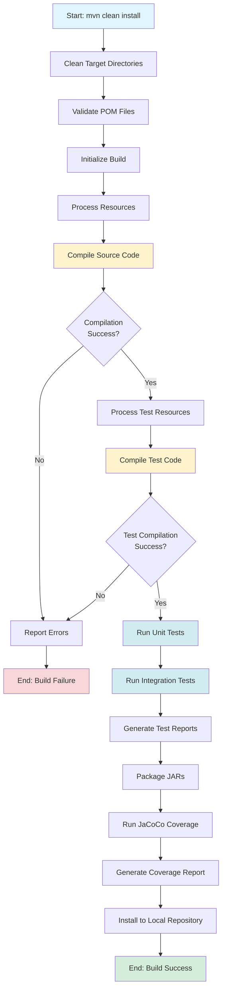
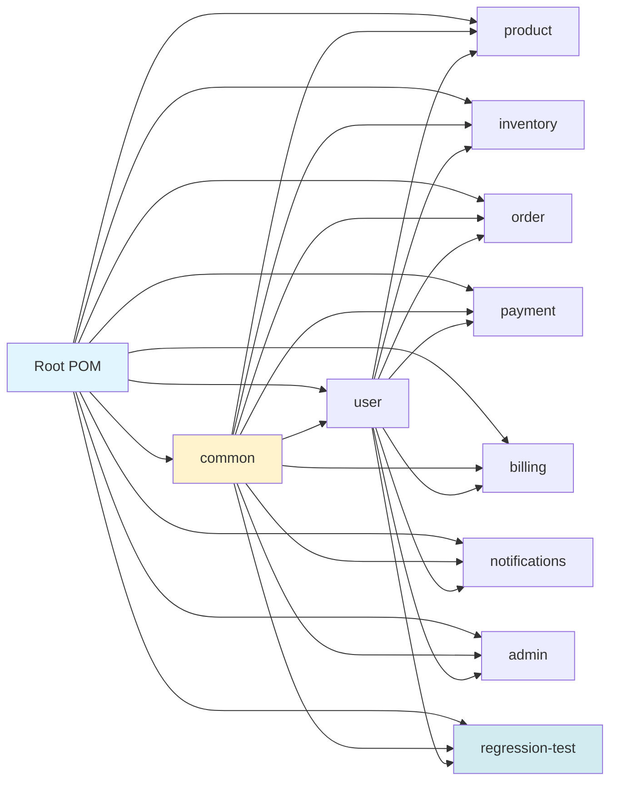
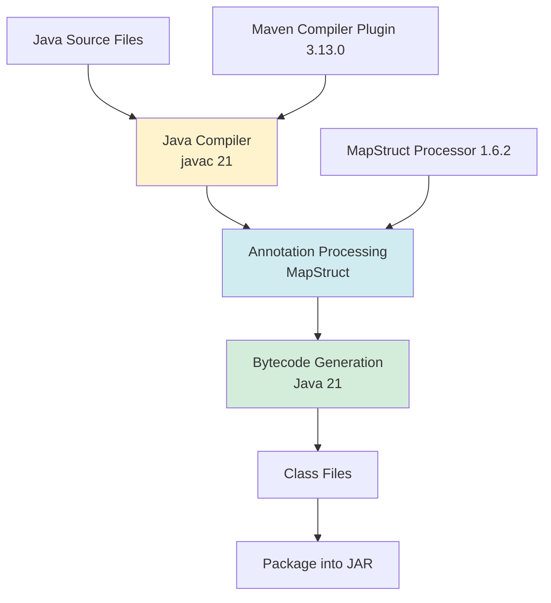

# Build Flow Diagram

## Maven Build Process

```mermaid
graph TD
    A[Start: mvn clean install] --> B[Clean Target Directories]
    B --> C[Validate POM Files]
    C --> D[Initialize Build]
    D --> E[Process Resources]
    E --> F[Compile Source Code]
    F --> G{Compilation<br/>Success?}
    G -->|No| H[Report Errors]
    H --> Z[End: Build Failure]
    G -->|Yes| I[Process Test Resources]
    I --> J[Compile Test Code]
    J --> K{Test Compilation<br/>Success?}
    K -->|No| H
    K -->|Yes| L[Run Unit Tests]
    L --> M[Run Integration Tests]
    M --> N[Generate Test Reports]
    N --> O[Package JARs]
    O --> P[Run JaCoCo Coverage]
    P --> Q[Generate Coverage Report]
    Q --> R[Install to Local Repository]
    R --> S[End: Build Success]
    
    style A fill:#e1f5ff
    style S fill:#d4edda
    style Z fill:#f8d7da
    style F fill:#fff3cd
    style J fill:#fff3cd
    style L fill:#d1ecf1
    style M fill:#d1ecf1
```

## Module Build Order

```mermaid
graph LR
    A[Root POM] --> B[common]
    A --> C[user]
    A --> D[product]
    A --> E[inventory]
    A --> F[order]
    A --> G[payment]
    A --> H[billing]
    A --> I[notifications]
    A --> J[admin]
    A --> K[regression-test]
    
    B --> C
    B --> D
    B --> E
    B --> F
    B --> G
    B --> H
    B --> I
    B --> J
    B --> K
    
    C --> D
    C --> E
    C --> F
    C --> G
    C --> H
    C --> I
    C --> J
    C --> K
    
    style A fill:#e1f5ff
    style B fill:#fff3cd
    style K fill:#d1ecf1
```

## Compilation Process

```mermaid
graph TD
    A[Java Source Files] --> B[Java Compiler<br/>javac 21]
    B --> C[Annotation Processing<br/>MapStruct]
    C --> D[Bytecode Generation<br/>Java 21]
    D --> E[Class Files]
    E --> F[Package into JAR]
    
    G[Maven Compiler Plugin 3.13.0] --> B
    H[MapStruct Processor 1.6.2] --> C
    
    style B fill:#fff3cd
    style C fill:#d1ecf1
    style D fill:#d4edda
```

