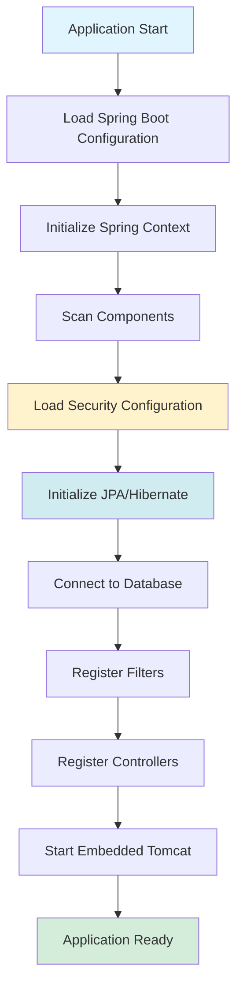
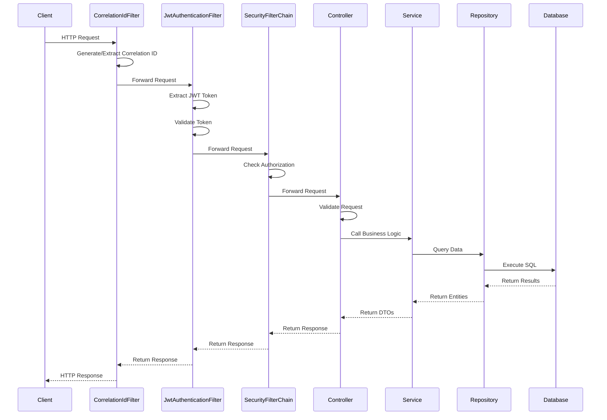
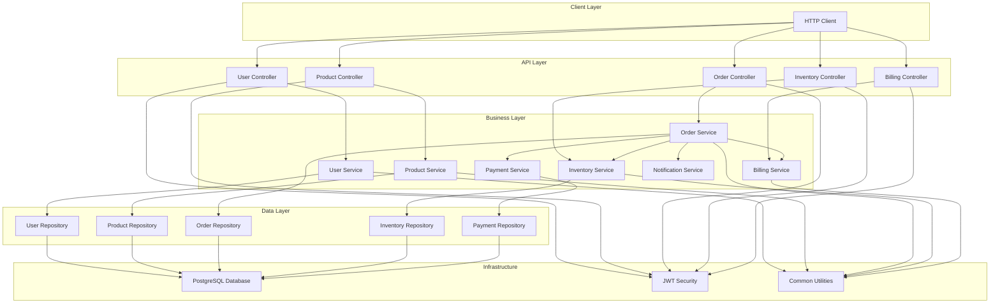
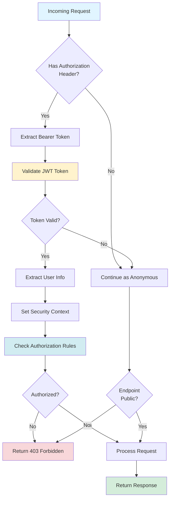
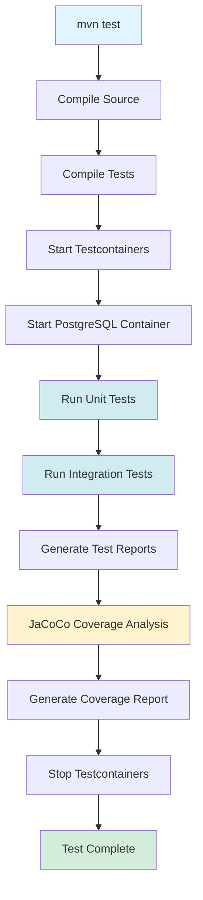

# Runtime Architecture Flow

## Application Startup Flow

```mermaid
graph TD
    A[Application Start] --> B[Load Spring Boot Configuration]
    B --> C[Initialize Spring Context]
    C --> D[Scan Components]
    D --> E[Load Security Configuration]
    E --> F[Initialize JPA/Hibernate]
    F --> G[Connect to Database]
    G --> H[Register Filters]
    H --> I[Register Controllers]
    I --> J[Start Embedded Tomcat]
    J --> K[Application Ready]
    
    style A fill:#e1f5ff
    style K fill:#d4edda
    style E fill:#fff3cd
    style F fill:#d1ecf1
```

## Request Processing Flow

```mermaid
sequenceDiagram
    participant Client
    participant CorrelationIdFilter
    participant JwtAuthenticationFilter
    participant SecurityFilterChain
    participant Controller
    participant Service
    participant Repository
    participant Database
    
    Client->>CorrelationIdFilter: HTTP Request
    CorrelationIdFilter->>CorrelationIdFilter: Generate/Extract Correlation ID
    CorrelationIdFilter->>JwtAuthenticationFilter: Forward Request
    JwtAuthenticationFilter->>JwtAuthenticationFilter: Extract JWT Token
    JwtAuthenticationFilter->>JwtAuthenticationFilter: Validate Token
    JwtAuthenticationFilter->>SecurityFilterChain: Forward Request
    SecurityFilterChain->>SecurityFilterChain: Check Authorization
    SecurityFilterChain->>Controller: Forward Request
    Controller->>Controller: Validate Request
    Controller->>Service: Call Business Logic
    Service->>Repository: Query Data
    Repository->>Database: Execute SQL
    Database-->>Repository: Return Results
    Repository-->>Service: Return Entities
    Service-->>Controller: Return DTOs
    Controller-->>SecurityFilterChain: Return Response
    SecurityFilterChain-->>JwtAuthenticationFilter: Return Response
    JwtAuthenticationFilter-->>CorrelationIdFilter: Return Response
    CorrelationIdFilter-->>Client: HTTP Response
```

## Module Interaction Flow

```mermaid
graph TB
    subgraph "Client Layer"
        A[HTTP Client]
    end
    
    subgraph "API Layer"
        B[User Controller]
        C[Product Controller]
        D[Order Controller]
        E[Inventory Controller]
        F[Billing Controller]
    end
    
    subgraph "Business Layer"
        G[User Service]
        H[Product Service]
        I[Order Service]
        J[Inventory Service]
        K[Billing Service]
        L[Payment Service]
        M[Notification Service]
    end
    
    subgraph "Data Layer"
        N[User Repository]
        O[Product Repository]
        P[Order Repository]
        Q[Inventory Repository]
        R[Payment Repository]
    end
    
    subgraph "Infrastructure"
        S[PostgreSQL Database]
        T[JWT Security]
        U[Common Utilities]
    end
    
    A --> B
    A --> C
    A --> D
    A --> E
    A --> F
    
    B --> G
    C --> H
    D --> I
    E --> J
    F --> K
    
    I --> J
    I --> K
    I --> L
    I --> M
    
    G --> N
    H --> O
    I --> P
    J --> Q
    L --> R
    
    N --> S
    O --> S
    P --> S
    Q --> S
    R --> S
    
    B --> T
    C --> T
    D --> T
    E --> T
    F --> T
    
    G --> U
    H --> U
    I --> U
    J --> U
    K --> U
```

## Security Flow

```mermaid
graph TD
    A[Incoming Request] --> B{Has Authorization<br/>Header?}
    B -->|No| C[Continue as Anonymous]
    B -->|Yes| D[Extract Bearer Token]
    D --> E[Validate JWT Token]
    E --> F{Token Valid?}
    F -->|No| C
    F -->|Yes| G[Extract User Info]
    G --> H[Set Security Context]
    H --> I[Check Authorization Rules]
    I --> J{Authorized?}
    J -->|No| K[Return 403 Forbidden]
    J -->|Yes| L[Process Request]
    C --> M{Endpoint<br/>Public?}
    M -->|Yes| L
    M -->|No| K
    L --> N[Return Response]
    
    style A fill:#e1f5ff
    style N fill:#d4edda
    style K fill:#f8d7da
    style E fill:#fff3cd
    style I fill:#d1ecf1
```

## Test Execution Flow

```mermaid
graph TD
    A[mvn test] --> B[Compile Source]
    B --> C[Compile Tests]
    C --> D[Start Testcontainers]
    D --> E[Start PostgreSQL Container]
    E --> F[Run Unit Tests]
    F --> G[Run Integration Tests]
    G --> H[Generate Test Reports]
    H --> I[JaCoCo Coverage Analysis]
    I --> J[Generate Coverage Report]
    J --> K[Stop Testcontainers]
    K --> L[Test Complete]
    
    style A fill:#e1f5ff
    style L fill:#d4edda
    style F fill:#d1ecf1
    style G fill:#d1ecf1
    style I fill:#fff3cd
```

