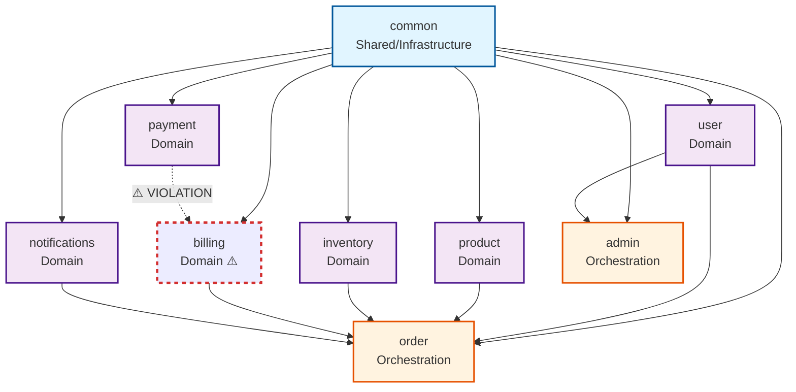
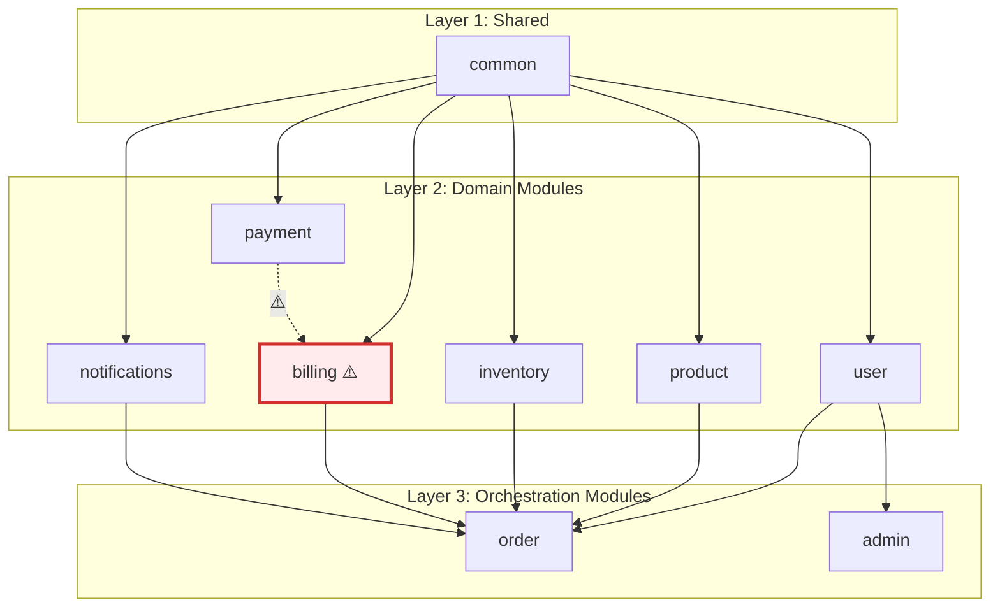
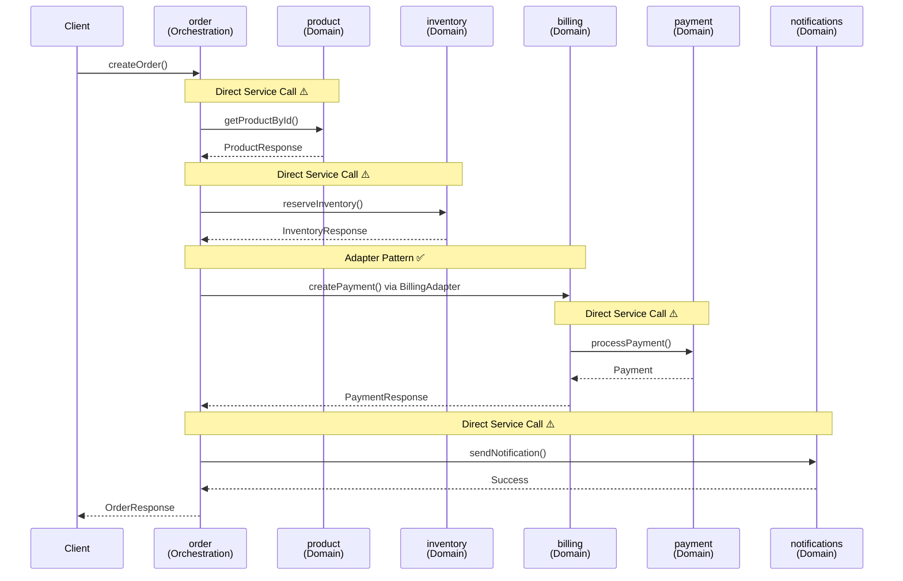
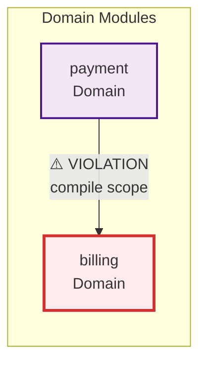
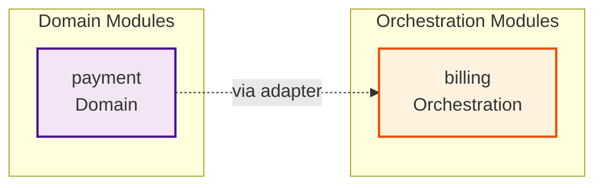
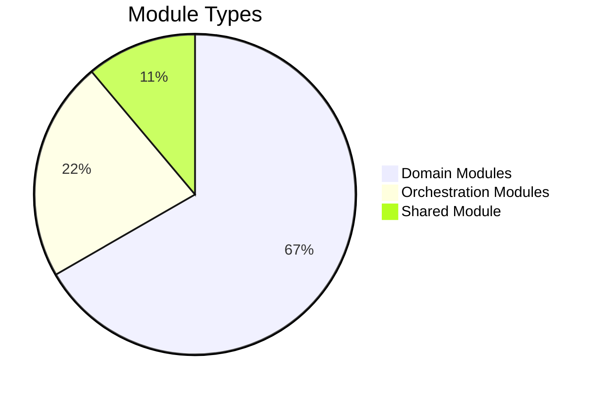
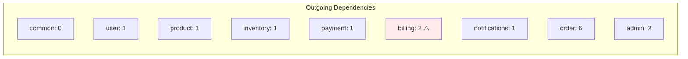
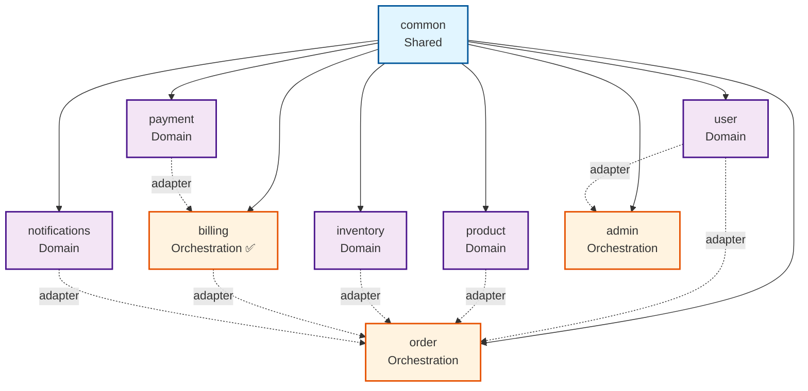
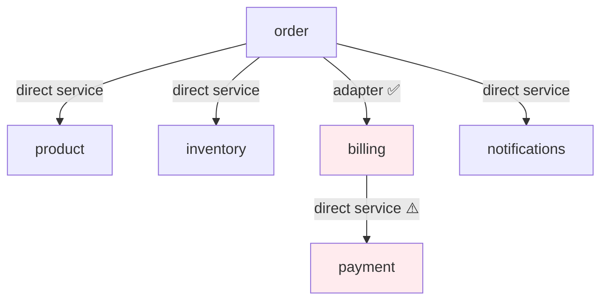
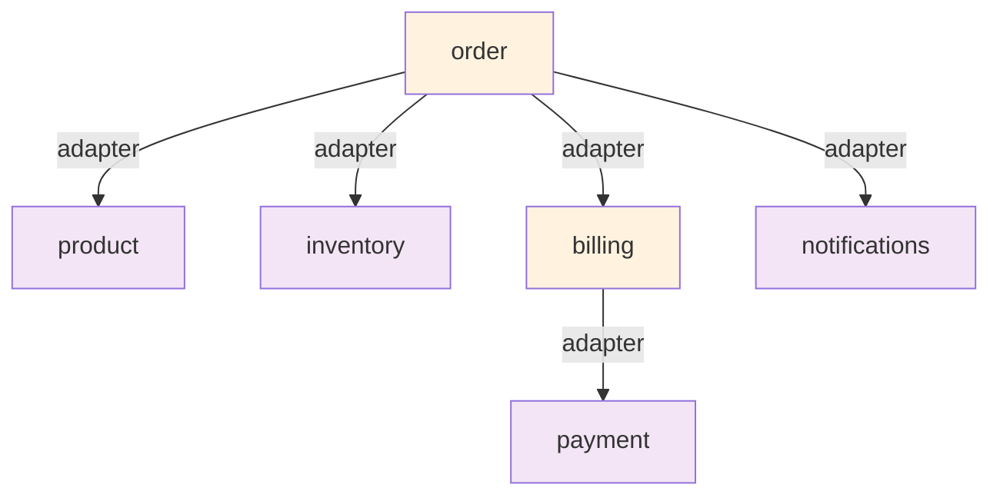

# Module Dependency Diagram

**Generated:** 2025-01-XX  
**Purpose:** Visual representation of module relationships and orchestration flow

---

## Module Dependency Graph

---

## Module Layer Diagram

---

## Orchestration Flow Diagram

---

## Dependency Violation Highlight

**Issue:** Direct domain-to-domain dependency violates architectural principle that domain modules should be independent.

**Recommended Fix:**

---

## Module Type Distribution

---

## Dependency Count Visualization

---

## Recommended Architecture (After Fixes)

**Key Changes:**
- `billing` reclassified as orchestration module
- All domain-to-orchestration communication via adapters (dashed lines)
- No direct domain-to-domain dependencies

---

## Module Interaction Patterns

### Current Pattern (With Violations)

### Recommended Pattern

---

## Usage Instructions

### Viewing the Diagrams

1. **In Markdown viewers:** Most modern Markdown viewers (GitHub, GitLab, VS Code with extensions) will render Mermaid diagrams automatically.

2. **Online:** Copy the Mermaid code blocks to [Mermaid Live Editor](https://mermaid.live/) for interactive viewing.

3. **VS Code:** Install the "Markdown Preview Mermaid Support" extension.

4. **Documentation:** Include these diagrams in your architecture documentation for visual reference.

### Updating Diagrams

When module dependencies change:
1. Update the dependency graph
2. Update the layer diagram if module classification changes
3. Update the orchestration flow if interaction patterns change
4. Regenerate violation highlights if new issues are found

---

**Report Status:** ✅ Complete  
**Diagram Format:** Mermaid (compatible with GitHub, GitLab, and most Markdown viewers)

